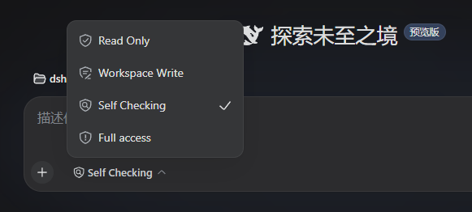

# dsh Self Checking profile



[English](README.md) | [中文](README.zh-CN.md)

This project is based on **dsh / DeepSeek Harness**, the open-source AI agent
harness by DeepSeek ([source](https://github.com/deepseek-ai/deepseek-harness)
· [`@deepseek-ai/dsh` on npm](https://www.npmjs.com/package/@deepseek-ai/dsh)):
it ships as a dsh *web profile* that layers a reproducible fork set on top of a
pristine dsh install — upstream packages stay untouched.

A drop-in dsh web profile that adds the **Self Checking** sandbox mode on top
of `workspace-write` and `danger-full-access`, as a fully reproducible fork
layer plus release tooling.

- **Fork layer** — 12 forked `@deepseek-ai` packages under `profile/forks/`
  that shadow the identical upstream packages for the profile only; upstream
  installs stay pristine.
- **Patch set** — `patches/*.json` (machine-applied anchored replacements) and
  `patches/*.diff` (human review) that rebuild the fork layer from a pristine
  dsh 0.1.0-rc.6 install, byte-for-byte.
- **Upstream tracking** — `upstream/` vendors the exact npm package bytes of
  the baseline, git-tracked and versioned in `upstream/VERSION`. Upgrading to
  a new dsh baseline is a **three-way merge** over that committed snapshot
  (`tools/merge-upstream.mjs`), not a blind re-patch: files changed only by
  upstream are taken, files changed only by the fork are kept, files changed
  on both sides are merged with `git merge-file` (diff3), and genuine
  conflicts surface with markers instead of silently misapplying.
- **Release tooling** — install scripts, an acceptance verifier, a rebuild
  tool for upstream upgrades, and a release packager.

## What Self Checking does

Self Checking is "full access with a workspace boundary check":

- Every command/operation runs under `workspace-write` confinement **by default**.
- A command/operation denied for touching a path **outside the workspace** is
  **intercepted once**: the model sees

  ```
  [sandbox: self-check intercepted — this command attempted to access a path
  outside the workspace; unless this access is intentional, do not re-run this
  command — if it IS intentional, re-run the exact same command and it will be
  allowed with full access]
  ```
  and nothing was executed.

  The notice demands a deliberate self-check: a re-run is the sanctioned
  continuation only when the outside access is intentional.
- A command that runs confined but **fails** (non-zero exit) is met with a
  similar defensive notice:

  ```
  [sandbox: self-check failed — this command failed; this may be a sandbox
  permission issue; unless this access is intentional, do not re-run this
  command — if it IS intentional, re-run the exact same command and it will be
  retried with full access]
  ```

  The failure *may* be a process-level sandbox restriction (named pipes,
  TLS/credential stores, privilege operations) that leaves no file ACL
  signature — this is the escape hatch for the interception blind spot.
- Re-running the **exact same command/operation** executes (or retries) it
  with **full access** (no approval prompt), for the rest of the session.
- Filesystem operations (write/edit) have **no automatic re-run unlock**: an
  ordinary mutation failure under self-checking gets the defensive notice
  appended and steers to the explicit escalation channel
  (`sandbox_permissions` + `justification`).

It is selectable like any other permission preset — Settings → Permission
(default for new sessions) or the composer permission picker / `/permission
self-checking` (current session).

## Repository layout

```
├── upstream/                  vendored baseline snapshot (git-tracked)
│   ├── VERSION                baseline version (e.g. 0.1.0-rc.6)
│   └── @deepseek-ai/          exact npm package bytes of the 12 packages
├── profile/                  the installable profile template
│   ├── forks/                the 12 forked packages (source of truth)
│   ├── cordis.patch.yml      Self Checking permission preset (+ layout notes)
│   ├── cordis.yml            profile root (empty entry list)
│   ├── package.json          bundles + fork `file:` dependencies
│   └── pnpm-workspace.yaml   nodeLinker: hoisted
├── patches/                  rebuild manifests (.json) + review diffs (.diff)
├── tools/
│   ├── snapshot-upstream.mjs vendor a new upstream baseline into upstream/
│   ├── merge-upstream.mjs    three-way merge a new baseline into the forks
│   ├── gen-patches.mjs       regenerate the patch set from pristine + forks
│   ├── rebuild-fork.mjs      rebuild the fork layer from pristine + patches
│   └── build-release.mjs     package the release zip
├── tests/
│   ├── verify-self-checking.mjs   dev regression (vocabulary/gate/fence/executor)
│   ├── verify-acl-probe.mjs       live windows-acl runner probe
│   └── profile-acl-test.mjs       full ACL chain against an installed profile
├── install.ps1 / install.sh  install the profile into $DSH_HOME
├── verify.mjs                acceptance verifier (copied into each install)
├── docs/                     screenshots referenced by the READMEs
├── CHANGELOG.md
└── LICENSE                   MIT (upstream packages keep their own LICENSE)
```

## Requirements

- dsh **0.1.0-rc.6** (the fork baseline; run `npx @deepseek-ai/dsh` once so the
  shared module fallback `~/.dsh/profiles/node_modules` exists)
- Windows, macOS, or Linux — the code is platform-neutral; the interception
  uses each platform's workspace-write backend (ACL restricted token on
  Windows, bwrap/Landlock on Linux, Seatbelt on macOS)

## Install

From a checkout of this repository:

```powershell
# Windows
powershell -ExecutionPolicy Bypass -File install.ps1          # installs as profile "self-checking"
```

```bash
# macOS / Linux
./install.sh
```

The script copies `profile/` to `~/.dsh/profiles/<name>/` and **assembles the
fork layer** from `profile/forks/` into `node_modules/@deepseek-ai/`
(node_modules is a build artifact and is not tracked by git). Then start:

```bash
npx @deepseek-ai/dsh --profile self-checking
```

### pnpm-managed install (optional)

The profile also ships its forks as `file:` dependencies in `package.json`,
so the fork layer can be (re)installed by the package manager instead of by
the copy step — installs no longer prune it, and upgrading the fork set is one
dependency bump:

```bash
# pnpm must be on PATH; the profile's pnpm-workspace.yaml uses
# nodeLinker: hoisted so the forks land as top-level real directories
dsh plugin --profile self-checking install
```

Verified layout (pnpm 10, hoisted linker, real profile location): the forks
resolve from `node_modules/@deepseek-ai/...` first, fork-internal imports stay
on the forks, and every undeclared dependency (`cordis`, `dsh-tools`, ...)
resolves from the shared fallback through the ordinary parent walk. A second
`pnpm install` keeps the forks (declared dependencies). Peer-dependency and
koffi build-script warnings are expected and harmless (the native koffi
binding comes from the `@koromix/koffi-<platform>` optional package).

To publish the forks as registry packages instead of local directories,
replace each `file:` spec with an npm alias — `"@deepseek-ai/dsh-sandbox":
"npm:<your-scope>/dsh-sandbox-selfchecking@<version>"` — the mechanism is
identical; you would need to publish the eleven fork packages first.

## Verify

`verify.mjs` (copied into every install) checks, along the real boot path:
fork resolution from the profile directory (including the client-side
`dsh-client-ui-conversation`, which the web plugin table resolves through the
same profile walk), the forked `SANDBOX_MODES`, the extended windows-acl
denial dialect, preset config validation, and the live filesystem fence
(inside passes → outside intercepted → re-run allowed).

```bash
node ~/.dsh/profiles/self-checking/verify.mjs --profile ~/.dsh/profiles/self-checking
```

## Development

```bash
# dev regression against the repo's own fork sources
node tests/verify-self-checking.mjs
# optional overrides: DSH_SC_FORKS=<fork dir> DSH_SC_UPSTREAM=<pristine @deepseek-ai dir>

# live ACL probe against the real windows-acl runner
node tests/verify-acl-probe.mjs
```

### Upgrading to a new dsh baseline

The vendored snapshot pins the exact npm package bytes of the baseline;
upgrading is a tracked three-way merge, not a blind re-patch:

```bash
# 1. obtain an npm-style extraction of the NEW dsh packages (e.g. the
#    node_modules/@deepseek-ai of a matching new install, or unpacked
#    tarballs) — keep it outside the repo

# 2. three-way merge it into the fork layer; on success the vendored
#    snapshot is replaced and upstream/VERSION updated
node tools/merge-upstream.mjs 0.1.0-rc.7 <new-extraction-dir>
#    merge rules: upstream-only changes are taken, fork-only changes are kept,
#    both-changed files are merged with git merge-file (diff3); genuine
#    conflicts are written into profile/forks with conflict markers and
#    reported (exit code 1), new upstream files are adopted, deleted files are
#    followed (or kept with a warning when the fork modified them)

# 3. resolve any conflict markers in profile/forks, then regenerate the patch
#    set and verify the rebuild is byte-identical:
node tools/gen-patches.mjs
node tools/rebuild-fork.mjs --upstream upstream/@deepseek-ai --out <tmp> --check profile/forks
node tests/verify-self-checking.mjs

# 4. commit upstream/ + profile/forks + patches together
```

`tools/snapshot-upstream.mjs <version> <extraction-dir>` vendors a baseline
from scratch (used to (re)create `upstream/`, e.g. the initial 0.1.0-rc.6
snapshot); commit it before running a merge, because the merge reads its base
from git HEAD.

Rebuilding the fork layer without an upgrade (e.g. after editing
`profile/forks/` by hand, or to check the baseline):

```bash
node tools/rebuild-fork.mjs --upstream upstream/@deepseek-ai --out <dir> --check profile/forks
```

If a rebuilt fork drifts from the `builtAgainst` baseline, `rebuild-fork.mjs`
fails loudly with the offending anchor; regenerate the patch manifests with:

```bash
node tools/gen-patches.mjs <upstream> <fork> <patches-out>
```

### Building a release

```bash
node tools/build-release.mjs [version]
# → dsh-profile-self-checking-<version>.zip (profile/ minus node_modules,
#   upstream/, patches, tools, tests, docs, install scripts)
```

## Notes / known limitations

- The interception gate is per-session in-memory state: a server restart
  resets it (a fresh session simply re-intercepts).
- Reads outside the workspace are not intercepted (matching workspace-write
  semantics); only denied file effects are.
- Agentless (non-model) calls under self-checking probe but have no re-run
  escape hatch — they stay denied (fail closed).
- Persistent terminals confine as workspace-write (no re-run flow inside a
  terminal).
- **Process-level restrictions have no interception, but now have a fail path.**
  The one-time interception fires only when the workspace-write probe fails
  with a *file ACL denial* that matches the backend's stderr signatures.
  Process-level restrictions of the restricted token leave no such signature
  — named pipes (`ssh.exe`/`sh.exe` "couldn't create signal pipe", capturing a
  child process's piped stdio), TLS / credential stores (schannel
  `SEC_E_NO_CREDENTIALS`, Git Credential Manager prompts), and operations
  needing privileges or Write-DAC (e.g. `SetNamedSecurityInfo`) — so they are
  never intercepted. Instead, the command exits non-zero, the model sees the
  `[sandbox: self-check failed ...]` notice, and the sanctioned re-run of the
  exact same command retries it with full access. Caveats: the first run
  already executed under confinement, so a re-run can repeat partial side
  effects; and a non-permission failure (a bug, a bad flag) fails again — the
  notice stays defensive, and the model should not re-run for its own sake.
  As an alternative, the model may request an explicit escalation with
  `sandbox_permissions: "danger-full-access"` + `justification` — the Self
  Checking preset ships with `approval: ask`, so the escalation prompt
  reaches the user (if the session's approval policy was switched to `never`
  separately, switch it back first). As a user, if you see the agent stuck
  re-failing on the same non-file error, prompt it to request the escalation.
- Do **not** run `dsh plugin --profile <name> install` in a profile whose
  forks were assembled by copy unless you keep `forks/` in sync (the package
  manager rebuilds node_modules from the declared `file:` deps).

## Uninstall

Remove the profile directory (`~/.dsh/profiles/self-checking`). Nothing
else is touched — upstream packages stay pristine.

## License

MIT. Each forked package retains its upstream `LICENSE` (Copyright (c) 2026
DeepSeek); the profile composition, patch set, tools, tests, and
documentation are MIT, Copyright (c) 2026 the profile author.
